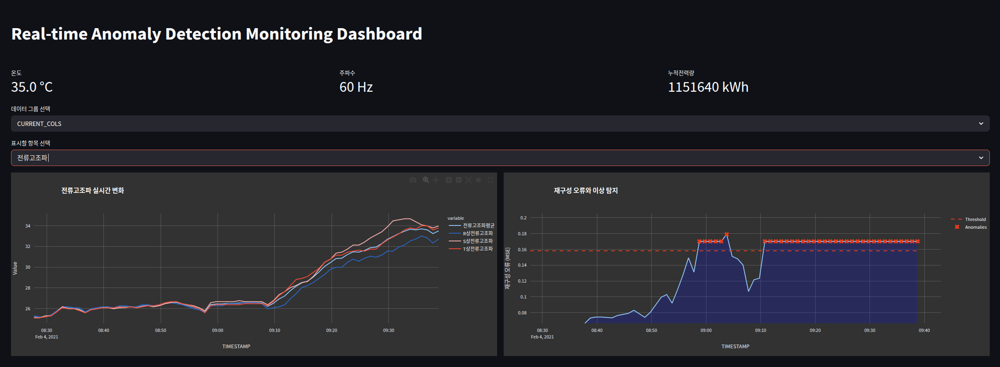

# 실시간 이상 탐지 대시보드 (Real-time Anomaly Detection Dashboard)

이 프로젝트는 **전력설비** 데이터를 실시간으로 모니터링하고 **오토인코더** 기반의 모델을 사용하여 **이상 탐지**를 수행하는 대시보드 시스템입니다. 실시간으로 수집되는 데이터를 시각화하고, 오토인코더 모델을 통해 이상 상태를 탐지하여 대시보드에서 이를 실시간으로 확인할 수 있습니다.

## 주요 기능

1. **실시간 데이터 시각화**
   - 다양한 전력설비 데이터를 실시간으로 시각화합니다.
   - 전압, 전류, 역률, 온도 등 다양한 항목을 실시간으로 보여줍니다.
   - 사용자가 선택한 데이터 항목에 대해 실시간 변화 그래프를 제공합니다.

2. **KPI 모니터링**
   - **온도**, **주파수**, **누적 전력량** 등을 실시간으로 모니터링하고, 대시보드에 표시됩니다.

3. **이상 탐지**
   - **오토인코더** 모델을 사용하여 **재구성 오류 (MSE)** 값을 계산하고 이상 상태를 탐지합니다.
   - 이상 탐지가 발생한 구간을 시각적으로 표시하고, **임계값**을 기준으로 이상 여부를 판단합니다.

4. **실시간 업데이트**
   - 데이터는 **1초 단위**로 실시간 갱신되며, 실시간 변화에 따라 대시보드를 업데이트합니다.

5. **대시보드 인터페이스**
   - **Streamlit**을 사용하여 간단하고 직관적인 웹 대시보드로 제공됩니다.
   - 사용자는 대시보드에서 데이터를 선택하고 실시간으로 변화하는 지표들을 확인할 수 있습니다.

## 사용 기술

- **Streamlit**: 실시간 대시보드와 UI 처리
- **Plotly**: 데이터 시각화 및 실시간 그래프 표시
- **Autoencoder**: 이상 탐지 모델을 사용하여 재구성 오류 기반으로 이상 상태를 탐지

# 프로젝트 폴더 및 파일 설명

| 항목                       | 설명                                                         |
|----------------------------|--------------------------------------------------------------|
| **📂 Modeling**             | 모델 훈련, 검증, 이상 탐지 관련 코드 및 데이터 폴더.        |
| **data/**                   | 훈련 및 검증 데이터가 저장된 폴더입니다.                     |
| **data/training/**          | 훈련용 데이터가 저장됩니다.                                 |
| **data/validation/**        | 모델 검증용 데이터가 저장됩니다.                             |
| **model/**                  | 훈련된 모델과 관련된 파일들이 저장되는 폴더입니다.          |
| **model/lstm_autoencoder.onnx** | 훈련된 LSTM Autoencoder 모델 파일입니다.                     |
| **model/scaler.pkl**        | 데이터 스케일링을 위한 피클 파일입니다.                     |
| **model/threshold.pkl**     | 이상 탐지 임계값 파일입니다.                                |
| **Anomaly_Detection_Modeling.ipynb** | 이상 탐지 모델을 훈련하는 Jupyter 노트북입니다.           |
| **Detection.ipynb**         | 훈련된 모델을 사용하여 이상 탐지를 실행하는 Jupyter 노트북입니다. |
| **📂 __pycache__**          | Python 컴파일된 바이트 코드 파일이 저장되는 폴더입니다.     |
| **.env**                    | 프로젝트의 환경 설정 파일.                                  |
| **DataLoader.py**           | 훈련과 검증 데이터를 로딩하고 전처리하는 코드입니다.         |
| **DetectModel.py**          | 훈련된 모델을 로드하고 이상 탐지를 수행하는 코드입니다.     |
| **README.md**               | 프로젝트 설명서 파일입니다.                                  |
| **Untitled-1.ipynb**        | 테스트용 Jupyter 노트북입니다. 사용되지 않는 파일일 수 있습니다. |
| **dashboard.py / dashboard2.py** | 실시간 데이터 시각화 및 이상 탐지 결과를 보여주는 Streamlit 대시보드 파일입니다. |
